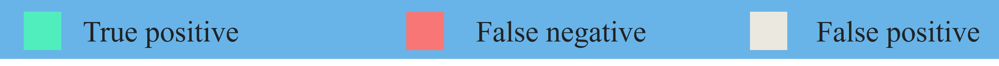
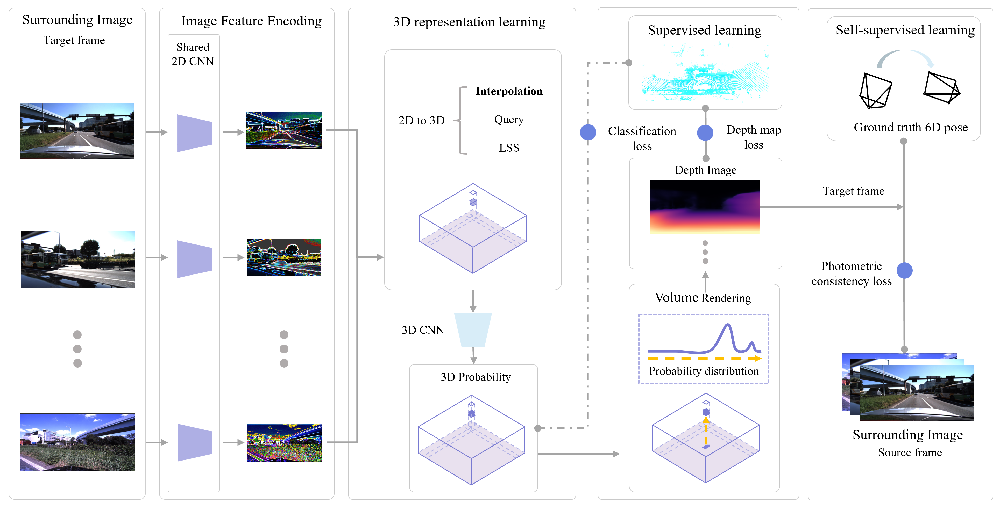
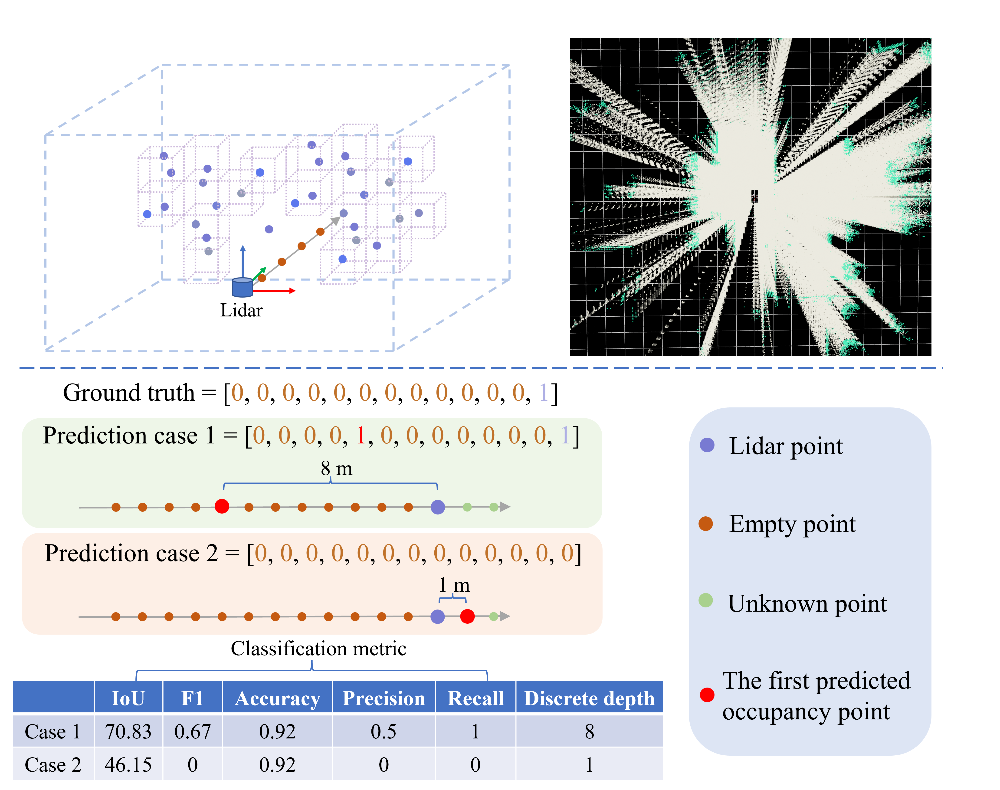

# SimpleOccupancy （一种简单的自动驾驶三维占用估计框架）

[文章链接](https://arxiv.org/pdf/2303.10076.pdf)

[代码链接](https://github.com/GANWANSHUI/SimpleOccupancy) 

> A **Simple** Framework for 3D **Occupancy** Estimation in Autonomous Driving
> 
> Wanshui Gan, Ningkai Mo, Hongbin Xu, Naoto Yokoya 
> 
> 东京大学，RIKEN(日本理化学研究所)， 深圳先进院，华南理工大学


## 主要贡献点 （Hightlight）
- 第一个提出使用体渲染进行3D occupancy表征学习的工作，早于[UniOcc](https://arxiv.org/abs/2306.09117)及其后续工作[RenderOcc](https://arxiv.org/abs/2309.09502)。
- 文章提出了一个框架，从网络设计，损失函数设计，以及评价指标三个方面综合讨论了使用体渲染进行occupancy估计的潜力，同时搭建了与深度估计方法的对比排行榜。
- 首次引入了符号距离场（SDF）进行进行3D重建任务的探讨，并且首次介绍了使用深度自监督的方法来训练，最后通过提出的离散深度指标验证了有效性。
- 通过提出的离散采样进行基于点级别的分类预训练，可以实现对现有语义occupancy框架的性能提升，例如[SurroundOcc](https://openaccess.thecvf.com/content/ICCV2023/html/Wei_SurroundOcc_Multi-camera_3D_Occupancy_Prediction_for_Autonomous_Driving_ICCV_2023_paper.html)。
- 文章总体通过体渲染的方式参考[Monodepth2](https://openaccess.thecvf.com/content_ICCV_2019/html/Godard_Digging_Into_Self-Supervised_Monocular_Depth_Estimation_ICCV_2019_paper.html)， 完成了对驾驶场景的几何表征学习，包括深度，体素（occupancy），以及Mesh。文章对后续语义occupancy 以及驾驶场景的3D重建都有较大参考价值。


## 背景知识
对于驾驶场景的感知，我们不需要特别细节的场景的3D构造，因而使用离散化的几何表达可以有效节省计算资源，例如使用体素（voxel）来表达3D空间的占有（occupancy）情况。继2021年的TESLA的AI Days的鸟瞰图（BEV）感知之后，在2022年, TESLA 首先在年中CVPR 2022 Workshop 向学界展示了3D occupancy的价值，而后又在10月份的AI Days上更充分向公众展示了更多细节。
3D occupancy 估计并不新鲜，先于TESLA， [SemanticKITTI](https://openaccess.thecvf.com/content_ICCV_2019/html/Behley_SemanticKITTI_A_Dataset_for_Semantic_Scene_Understanding_of_LiDAR_Sequences_ICCV_2019_paper.html) 数据集已于ICCV 2019 提出并得到广泛的关注。得益于TESLA大厂的认证加持，2022年之后，3D occupancy估计
在学术和工业界都吸引了从业人员的讨论和更多关注。


## Demo

### RGB, Depth and Mesh:
<p align='center'>

</p>
<p align='center'>
Self-supervised learning with SDF (Max depth = 52 m )
</p>


---

<p align='center'>

</p>
<p align='center'>
Self-supervised learning with Density (Max depth = 52 m)
</p>


### Sparse occupancy prediction:

<p align='center'>
  

</p>

### Dense occupancy prediction:
<p align='center'>

</p>


### Point-level training as the pretrain for 3D semantic occupancy:
<p align='center'>

</p>


## Abstract
The task of estimating 3D occupancy from surrounding-view images is an exciting development in the field of autonomous driving, following the success of Bird's Eye View (BEV) perception. This task provides crucial 3D attributes of the driving environment, enhancing the overall understanding and perception of the surrounding space. In this work, we present a simple framework for 3D occupancy estimation, which is a CNN-based framework designed to reveal several key factors for 3D occupancy estimation, such as network design, optimization, and evaluation. In addition, we explore the relationship between 3D occupancy estimation and other related tasks, such as monocular depth estimation and 3D reconstruction, which could advance the study of 3D perception in autonomous driving. For evaluation, we propose a simple sampling strategy to define the metric for occupancy evaluation, which is flexible for current public datasets. Moreover, we establish the benchmark in terms of the depth estimation metric, where we compare our proposed method with monocular depth estimation methods on the DDAD and Nuscenes datasets and achieve competitive performance. 
## Method 

Proposed network:
<p align='center'>

</p>

Occupancy label and metric comparison:


<p align='center'>

</p>


## Acknowledgement
Many thanks to these excellent projects:
- [simple_bev](https://github.com/aharley/simple_bev)
- [SurroundDepth](https://github.com/weiyithu/SurroundDepth)


Related Projects:
- [TPVFormer](https://github.com/wzzheng/TPVFormer)
- [OpenOccupancy](https://github.com/JeffWang987/OpenOccupancy)
- [SurroundOcc](https://github.com/weiyithu/SurroundOcc)
- [VoxFormer](https://github.com/NVlabs/VoxFormer)
- [MonoScene](https://github.com/astra-vision/MonoScene)
- [BEVFormer](https://github.com/fundamentalvision/BEVFormer)


## Bibtex
If you find this repository/work helpful in your research, welcome to cite the paper and give a ⭐.
```
@article{gan2023simple,
  title={A Simple Attempt for 3D Occupancy Estimation in Autonomous Driving},
  author={Gan, Wanshui and Mo, Ningkai and Xu, Hongbin and Yokoya, Naoto},
  journal={arXiv preprint arXiv:2303.10076},
  year={2023}
}
```


