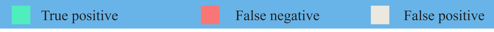
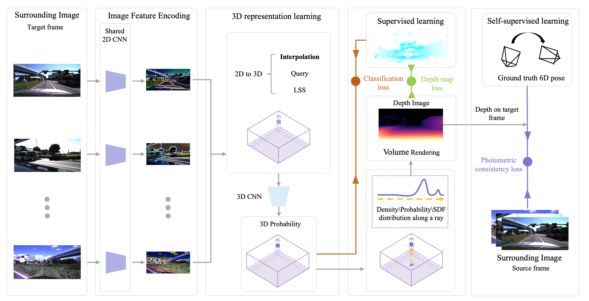
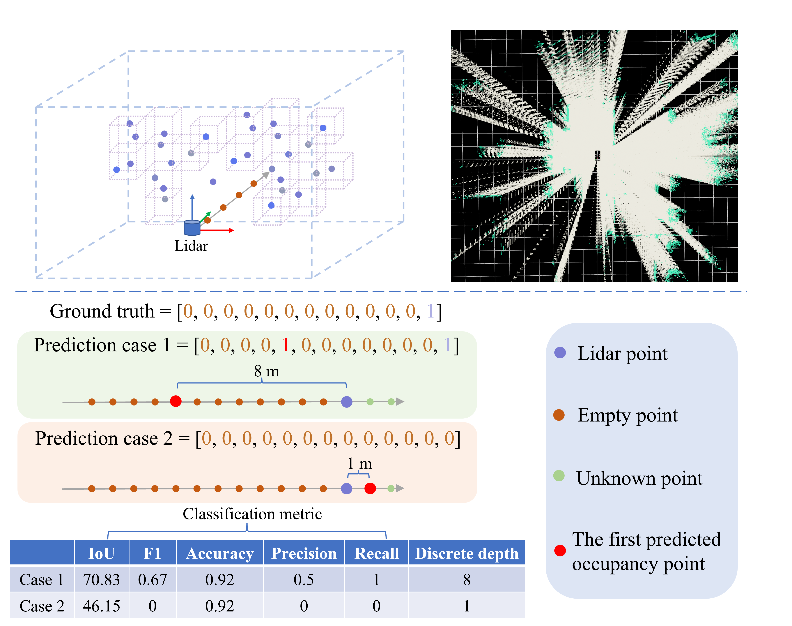
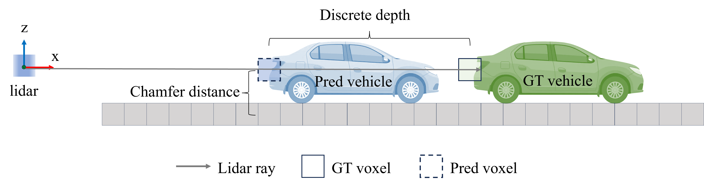

# SimpleOccupancy (IEEE TIV 2024)

[Arxiv Paper](https://arxiv.org/pdf/2303.10076.pdf)

[IEEE TIV Early Access](https://www.dropbox.com/scl/fi/41v8kk0rynfxxjp8ri0dr/A_Comprehensive_Framework_for_3D_Occupancy_Estimation_in_Autonomous_Driving.pdf?rlkey=cbdeu6ivm2az1937wrutox41k&st=so5k80hh&dl=0) (recommend to read this one)

[Supplement](https://www.dropbox.com/scl/fi/ui1wyf09ve4finqultpei/SimpleOcc_supplement.pdf?rlkey=z6o07oke3u7f19ojp3j0sxk7f&st=lgsftfad&dl=0)

[中文解读](https://zhuanlan.zhihu.com/p/673456177)

> A **Comprehensive** Framework for 3D **Occupancy** Estimation in Autonomous Driving
> 
> Wanshui Gan, Ningkai Mo, Hongbin Xu, Naoto Yokoya
> 
> Previous used titles, 1) A Simple Framework for 3D Occupancy Estimation in Autonomous Driving, 2) A Simple Attempt for 3D Occupancy Estimation in Autonomous Driving.   谁懂啊，QwQ


## News
-- Note that the demos are large, please wait a moment to load them. 
- [2024/05/14]: This work has been accepted by IEEE Transactions on Intelligent Vehicles.
- [2023/12/20]: Supplement the code self-supervised learning, 3D (sdf,mesh) reconstruction and its visualization.
- [2023/10/20]: We extend the framework to the 3D reconstruction task based on the SDF at the mesh level with the self-supervised setting. I am open to discussion and collaboration on related topics.
- [2023/10/07]: Update the paper. The first and preliminary version is realeased. Code may not be cleaned thoroughly, so feel free to open an issue if any question.
- [2023/4/05]: Update the paper with supplementary material. Code repository is still under construction.
- [2023/3/18]: Initial release.

## Demo  

### RGB, Depth and Mesh:
<p align='center'>

</p>
<p align='center'>
Self-supervised learning with SDF (Max depth = 52 m )
</p>


---

<p align='center'>

</p>
<p align='center'>
Self-supervised learning with Density (Max depth = 52 m)
</p>


### Sparse occupancy prediction:

<p align='center'>
  

</p>

### Dense occupancy prediction:
<p align='center'>

</p>


### Point-level training as the pretrain for 3D semantic occupancy:
<p align='center'>

</p>


## Abstract
The task of estimating 3D occupancy from surrounding-view images is an exciting development in the field of autonomous driving, following the success of Bird's Eye View (BEV) perception. This task provides crucial 3D attributes of the driving environment, enhancing the overall understanding and perception of the surrounding space. In this work, we present a simple framework for 3D occupancy estimation, which is a CNN-based framework designed to reveal several key factors for 3D occupancy estimation, such as network design, optimization, and evaluation. In addition, we explore the relationship between 3D occupancy estimation and other related tasks, such as monocular depth estimation and 3D reconstruction, which could advance the study of 3D perception in autonomous driving. For evaluation, we propose a simple sampling strategy to define the metric for occupancy evaluation, which is flexible for current public datasets. Moreover, we establish a benchmark in terms of the depth estimation metric, where we compare our proposed method with monocular depth estimation methods on the DDAD and Nuscenes datasets and achieve competitive performance. 
## Method 

Proposed network:
<p align='center'>

</p>

Occupancy label and metric comparison:


<p align='center'>

</p>
The proposed discrete depth metric and chamfer distance metric comparison:

<p align='center'>

</p>

## Acknowledgement
Many thanks to these excellent projects:
- [simple_bev](https://github.com/aharley/simple_bev)
- [SurroundDepth](https://github.com/weiyithu/SurroundDepth)


Related Projects:
- [TPVFormer](https://github.com/wzzheng/TPVFormer)
- [OpenOccupancy](https://github.com/JeffWang987/OpenOccupancy)
- [SurroundOcc](https://github.com/weiyithu/SurroundOcc)
- [VoxFormer](https://github.com/NVlabs/VoxFormer)
- [MonoScene](https://github.com/astra-vision/MonoScene)
- [BEVFormer](https://github.com/fundamentalvision/BEVFormer)

This work was partially supported by JST, FOREST under Grant Number JPMJFR206S. Wanshui Gan would also like to express gratitude for the student scholarship provided by TIER IV.


## Bibtex
If you find this repository/work helpful in your research, welcome to cite the paper and give a ⭐.
```
@article{gan2023simple,
  title={A Simple Attempt for 3D Occupancy Estimation in Autonomous Driving},
  author={Gan, Wanshui and Mo, Ningkai and Xu, Hongbin and Yokoya, Naoto},
  journal={arXiv preprint arXiv:2303.10076},
  year={2023}
}

@article{gan2024comprehensive,
  title={A Comprehensive Framework for 3D Occupancy Estimation in Autonomous Driving},
  author={Gan, Wanshui and Mo, Ningkai and Xu, Hongbin and Yokoya, Naoto},
  journal={IEEE Transactions on Intelligent Vehicles},
  year={2024},
  publisher={IEEE}
}
```


