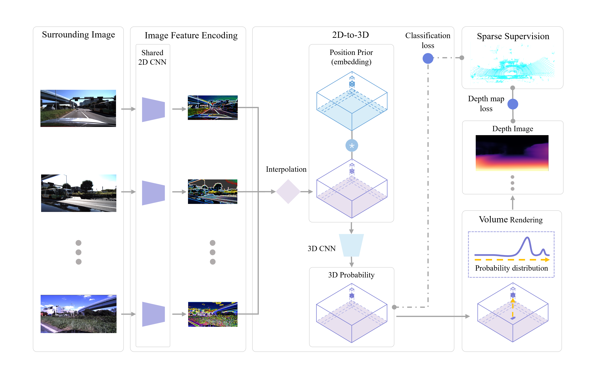

# SimpleOccupancy

[//]: # (### [Project Page]&#40;https://weiyithu.github.io/SurroundOcc/&#41; | [Paper]&#40;https://arxiv.org/abs/2303.09551&#41; | [Video]&#40;https://cloud.tsinghua.edu.cn/d/97b74c039b8d4fd48830/&#41; | [Data]&#40;https://cloud.tsinghua.edu.cn/d/8dcb547238144d08a0bb/&#41;)

[//]: # (<br/>)

> A **Simple** Attempt for 3D **Occupancy** Estimation in Autonomous Driving
> 
> Wanshui Gan, Ningkai Mo, Hongbin Xu, Naoto Yokoya 
 
## News

- [2023/3/20]: Initial release.

## Demo  

### Sparse occupancy prediction:

<p align='center'>


</p>

### Dense occupancy prediction:
<p align='center'>

</p>


## Introduction
The task of estimating 3D occupancy from surrounding-view images is an exciting development in the field of autonomous driving, following the success of Bird's Eye View (BEV) perception. This task provides crucial 3D attributes of the driving environment, enhancing the overall understanding and perception of the surrounding space. However, there is still a lack of a baseline to define the task, such as network design, optimization, and evaluation. In this work, we present a simple attempt for 3D occupancy estimation, which is a CNN-based framework designed to reveal several key factors for 3D occupancy estimation. In addition, we explore the relationship between 3D occupancy estimation and other related tasks, such as monocular depth estimation, stereo matching, and BEV perception (3D object detection and map segmentation), which could advance the study on 3D occupancy estimation. For evaluation, we propose a simple sampling strategy to define the metric for occupancy evaluation, which is flexible for current public datasets. Moreover, we establish a new benchmark in terms of the depth estimation metric, where we compare our proposed method with monocular depth estimation methods on the DDAD and Nuscenes datasets.

## Method 

Method Pipeline:

<p align='center'>

</p>

Occupancy label and metric comparison:


<p align='center'>

</p>


## Acknowledgement
Many thanks to these excellent projects:
- [simple_bev](https://github.com/aharley/simple_bev)
- [SurroundDepth](https://github.com/weiyithu/SurroundDepth)


Related Projects:
- [TPVFormer](https://github.com/wzzheng/TPVFormer)
- [OpenOccupancy](https://github.com/JeffWang987/OpenOccupancy)
- [SurroundOcc](https://github.com/weiyithu/SurroundOcc)
- [VoxFormer](https://github.com/NVlabs/VoxFormer)
- [MonoScene](https://github.com/astra-vision/MonoScene)
- [BEVFormer](https://github.com/fundamentalvision/BEVFormer)


## Bibtex

[//]: # (If this work is helpful for your research, please consider citing the following BibTeX entry.)

[//]: # (```)

[//]: # (@article{wei2023surroundocc, )

[//]: # (      title={SurroundOcc: Multi-Camera 3D Occupancy Prediction for Autonomous Driving}, )

[//]: # (      author={Yi Wei and Linqing Zhao and Wenzhao Zheng and Zheng Zhu and Jie Zhou and Jiwen Lu},)

[//]: # (      journal={arXiv preprint arXiv:2303.09551},)

[//]: # (      year={2023})

[//]: # (})

[//]: # (```)


